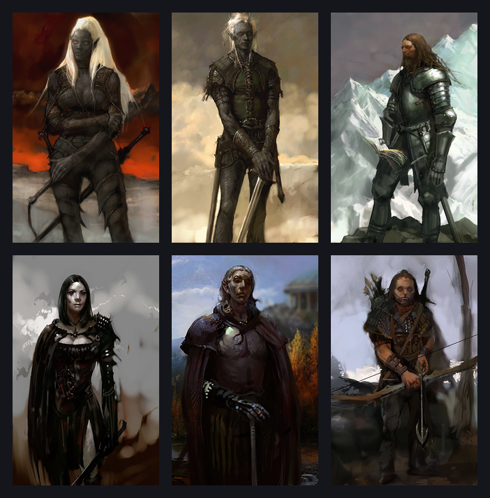
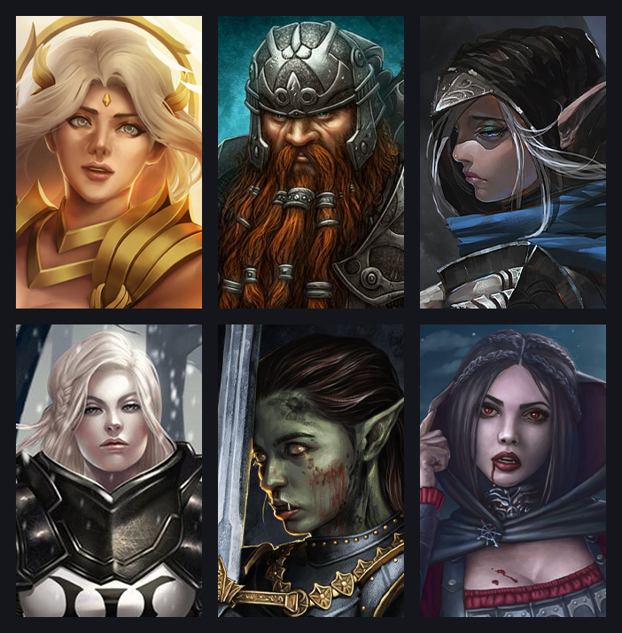

# Sauler IE Portraits

A curated portrait collection for **Baldur's Gate: Enhanced Edition**, **Baldur's Gate II: Enhanced Edition**, **Enhanced Edition Trilogy (EET)**, and **Icewind Dale: Enhanced Edition**.

The mod installs everything through **one WeiDU component**.

## Included portraits

- Main Collection: **250** selected portraits
- Icewind Dale II: **23** selected portraits
- Garion's Portrait Pack: **89** selected portraits
- Photoshopped Variations: **10** selected portraits
- IWDEE only: **59 zoomed vanilla sidebar replacements**

Total custom portraits: **372** — **212 male** and **160 female**.

## Portrait examples

A few examples from the portrait sets included in **Sauler IE Portraits**.

### Icewind Dale II

### Garion's Portrait Pack

## Portrait behavior

Male and female portraits remain separated correctly in the character portrait selector.

Each custom portrait has two variants:

- **L** — large, non-zoomed portrait used in character creation and the Character Record
- **M** — zoomed portrait used in the in-game party sidebar

Custom portrait resource names are clean and Infinity Engine-safe:

- male: `SIPM001` … `SIPM212`
- female: `SIPF001` … `SIPF160`

The 59 IWDEE vanilla sidebar replacements keep their original game resource names because they must replace those exact resources.

## Compatibility

Supported games:

- BG:EE
- BG2:EE
- EET
- IWDEE

The mod supports both the **vanilla Enhanced Edition UI** and **Infinity UI++**. Infinity UI++ should be installed before Sauler IE Portraits.

The custom portrait collection installs on all supported games. The 59 vanilla sidebar replacements are installed only on IWDEE.

## Installation

Copy the `Sauler-IE-portraits` folder and `setup-Sauler-IE-portraits.exe` into the game directory beside `chitin.key`, then run the installer.

## Credits

The collection includes portraits and adaptations originating from Ineth's portrait projects and Garion's Portrait Pack, together with original Icewind Dale / Icewind Dale II artwork and other credited source artists.

See [CREDITS.md](CREDITS.md) for full attribution, permissions, and source links. The complete old-to-new resource mapping is available in [docs/portrait-map.csv](docs/portrait-map.csv).
